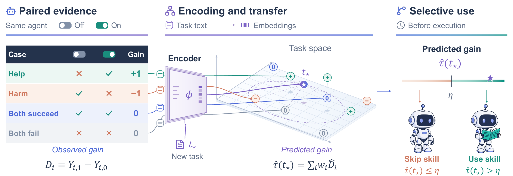

# SkillDelta

**Can we tell whether a skill will help before an agent executes a task?**
SkillDelta estimates the benefit of a supplied skill from paired historical
executions, then chooses **Use skill** or **Skip skill** for a new task.

Implementation for *When Does a Skill Add Value? Task-Conditional Gain Prediction
for Selective Skill Use*.



This is a **code-only release**: the predictor, evaluation utilities,
data-collection code, and DeepSeek Harness plugin. Benchmark questions, supplied
skill corpora, execution records, embeddings, and experimental results are not
distributed here. Obtain benchmark inputs from their original sources and keep
generated artifacts local. Examples and tests use small synthetic fixtures.

## Quick start

Python 3.11 or newer:

```bash
python -m venv .venv
source .venv/bin/activate
python -m pip install -r requirements.txt
make demo
make test
```

The demo requires no dataset, model download, or API key.
`make plugin-demo` runs the Harness router offline.

## Where to start

| Goal | Entry point |
| --- | --- |
| Understand gain estimation and the decision rule | [Method](docs/method.md) · [predictor.py](skilldelta/predictor.py) |
| Generate paired execution records | [Data generation](docs/data-generation.md) · [experiments/](experiments/) |
| Encode and evaluate your own tasks | [Input formats](docs/data.md) · [Evaluation](docs/reproduction.md) |
| Route skills in DeepSeek Harness | [Plugin](plugins/dsh-skilldelta/README.md) · [中文说明](plugins/dsh-skilldelta/README.zh.md) |
| Check a release before publishing | [Release policy](docs/release.md) |

`skilldelta/` contains the estimator, ranking controls, and policy metrics.
`configs/protocols.json` records predictor settings without experimental outcomes.
`experiments/` retains original collection adapters and their budget controls;
external dependencies and protocol-specific requirements are documented.

## License and citation

Original code is released under [MIT](LICENSE). See [NOTICE.md](NOTICE.md) for
third-party attribution and figure terms. Citation metadata is in
[CITATION.cff](CITATION.cff).
